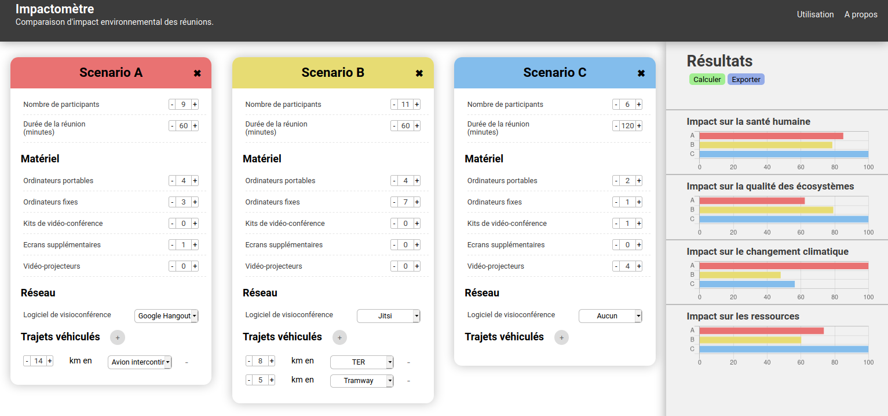
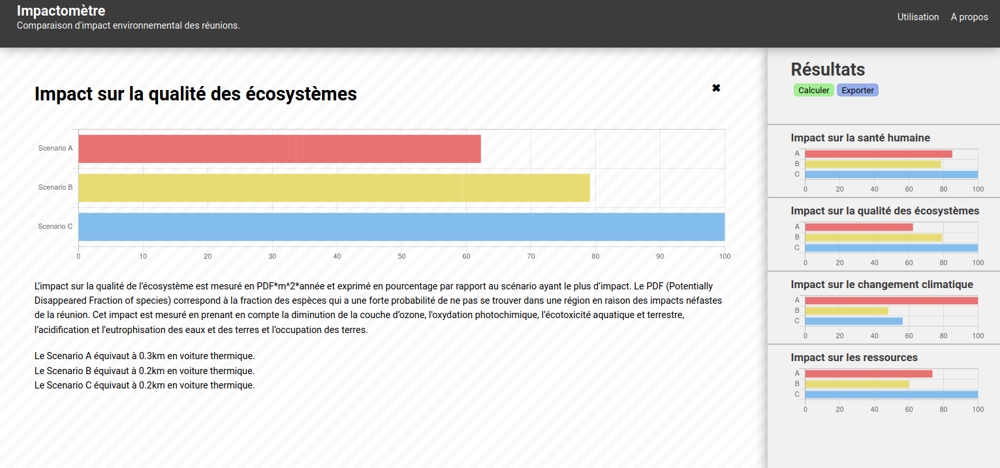

# Impactometre

**Demo** : https://impactometre2.herokuapp.com

_This program is free software: you can redistribute it and/or modify
it under the terms of the GNU General Public License as published by
the Free Software Foundation, either version 3 of the License, or
(at your option) any later version._

_This program is distributed in the hope that it will be useful,
but WITHOUT ANY WARRANTY; without even the implied warranty of
MERCHANTABILITY or FITNESS FOR A PARTICULAR PURPOSE.  See the
GNU General Public License for more details._

## Description

Cette application permet de comparer l'impact environnemental de trois différents scénarios de réunions, pour différentes sphères de dommage : impact sur la santé humaine, sur la qualité des écosystèmes, sur le changement climatique et sur les ressources.

Les résultats sont présentés sous forme de pourcentage, par rapport à celui ayant le plus d'impact.

## Captures d'écran





## Technologies

Le back-end utilise `Node.js` tandis que le front-end utilise `VueJS`.

## Modification du texte sur l'interface gitlab/github

Il est possible d'éditer directement les fichiers sur gitlab ou github, de façon à mettre à jour simplement les différents textes contenus dans l'application.

### Modification de l'explication pour chaque sphères d'impact

Modifier le texte du fichier JSON `front/src/options/detailled_results_text.js`.

_Vous pouvez aussi changer directement l'intitulé des boutons et labels. Attention, une modification du code peut entraîner le disfonctionnement de l'application._

### Modification du texte de la section "A propos"
Se rendre sur le fichier `impactometre/front/src/components/SinglePage.vue` et modifier uniquement le texte entre les balises `<p>`.

### Modification des boutons et legendes des formulaires
Se rendre sur le fichier `impactometre/front/src/components/Scenario.vue` et modifier le texte entre les balises `<p>`.

### Modification du titre et du sous-titre de l'application
Se rendre sur le fichier `impactometre/front/src/components/Header.vue `et modifier le texte entre les balises `<h1>` pour le titre et entre les balises `<b>` pour le sous-titre.

## Pour développer

### Installer Node.js et npm
Avec Linux :
```bash
$ curl -sL https://deb.nodesource.com/setup_12.x | sudo -E bash -
$ sudo apt-get install -y nodejs
```
Avec Windows : [télécharger le .msi](https://nodejs.org/dist/v12.14.0/node-v12.14.0-x86.msi)

### Pour lancer le serveur
```bash
# Installer les dépendances
$ npm install
# Lancer le projet
$ npm run serve
```

## Communication entre le front-end et le back-end

Le client effectue une requête POST sur la route `api/meeting` afin d'obtenir les impacts comparatifs et équivalents.

### Exemple de payload JSON pour la requête POST

Pour deux scénarios.

```json
[
   {
      "meetingDuration":60,
      "numberOfParticipants":9,
      "hardware":[
         {
            "name":"LAPTOP",
            "french":"Ordinateurs portables",
            "qty":4
         },
         {
            "name":"DESKTOP",
            "french":"Ordinateurs fixes",
            "qty":3
         },
         {
            "name":"LOGITECH_KIT",
            "french":"Kits de vidéo-conférence",
            "qty":0
         },
         {
            "name":"COMPUTER_SCREEN_LCD",
            "french":"Ecrans supplémentaires",
            "qty":1
         },
         {
            "name":"PROJECTOR",
            "french":"Vidéo-projecteurs",
            "qty":0
         }
      ],
      "software":{
         "name":"HANGOUTS"
      },
      "journey":[
         {
            "distance":14,
            "mean":"PLANE_INTERCONTINENTAL_ONE_PERSON_KM"
         }
      ],
      "meetingScenario":"Scenario A"
   },
   {
      "meetingDuration":60,
      "numberOfParticipants":11,
      "hardware":[
         {
            "name":"LAPTOP",
            "french":"Ordinateurs portables",
            "qty":4
         },
         {
            "name":"DESKTOP",
            "french":"Ordinateurs fixes",
            "qty":7
         },
         {
            "name":"LOGITECH_KIT",
            "french":"Kits de vidéo-conférence",
            "qty":0
         },
         {
            "name":"COMPUTER_SCREEN_LCD",
            "french":"Ecrans supplémentaires",
            "qty":0
         },
         {
            "name":"PROJECTOR",
            "french":"Vidéo-projecteurs",
            "qty":0
         }
      ],
      "software":{
         "name":"JITSI"
      },
      "journey":[
         {
            "distance":8,
            "mean":"TRAIN_REGIONAL_ONE_PERSON_KM"
         },
         {
            "distance":5,
            "mean":"TRAMWAY_ONE_PERSON_KM"
         }
      ],
      "meetingScenario":"Scenario B"
   }
]
```
### Exemple de retour JSON pour la requête POST

```json
{
   "comparison":{
      "HUMAN_HEALTH":{
         "Scenario A":{
            "damageEndpoint":"HUMAN_HEALTH",
            "meetingScenario":"Scenario A",
            "value":85.04,
            "hardware":34.05,
            "software":0,
            "journey":50.98
         },
         "Scenario B":{
            "damageEndpoint":"HUMAN_HEALTH",
            "meetingScenario":"Scenario B",
            "value":78.55,
            "hardware":58.54,
            "software":0.31,
            "journey":19.7
         }
      },
      "ECOSYSTEM_QUALITY":{
         "Scenario B":{
            "damageEndpoint":"ECOSYSTEM_QUALITY",
            "meetingScenario":"Scenario B",
            "value":79.11,
            "hardware":59.17,
            "software":0.44,
            "journey":19.51
         },
         "Scenario A":{
            "damageEndpoint":"ECOSYSTEM_QUALITY",
            "meetingScenario":"Scenario A",
            "value":62.25,
            "hardware":33.68,
            "software":0,
            "journey":28.57
         }
      },
      "CLIMATE_CHANGE":{
         "Scenario A":{
            "damageEndpoint":"CLIMATE_CHANGE",
            "meetingScenario":"Scenario A",
            "value":100,
            "hardware":19.84,
            "software":0,
            "journey":80.16
         },
         "Scenario B":{
            "damageEndpoint":"CLIMATE_CHANGE",
            "meetingScenario":"Scenario B",
            "value":47.97,
            "hardware":34.35,
            "software":0.21,
            "journey":13.41
         }
      },
      "RESOURCES":{
         "Scenario A":{
            "damageEndpoint":"RESOURCES",
            "meetingScenario":"Scenario A",
            "value":73.52,
            "hardware":19.78,
            "software":0,
            "journey":53.73
         },
         "Scenario B":{
            "damageEndpoint":"RESOURCES",
            "meetingScenario":"Scenario B",
            "value":60.16,
            "hardware":32.81,
            "software":2.35,
            "journey":24.99
         }
      }
   },
   "equivalents":{
      "HUMAN_HEALTH":{
         "ONE_KM_CAR":{
            "Scenario A":0.2,
            "Scenario B":0.2,
         }
      },
      "ECOSYSTEM_QUALITY":{
         "ONE_KM_CAR":{
            "Scenario A":0.3,
            "Scenario B":0.2,
         }
      },
      "CLIMATE_CHANGE":{
         "ONE_KM_CAR":{
            "Scenario A":0.2,
            "Scenario B":0.4,
         }
      },
      "RESOURCES":{
         "ONE_KM_CAR":{
            "Scenario A":0.2,
            "Scenario B":0.2,
         }
      }
   }
}
```
